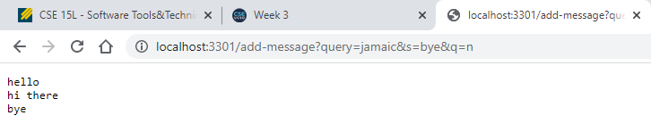
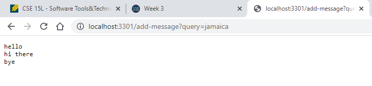
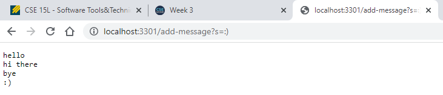
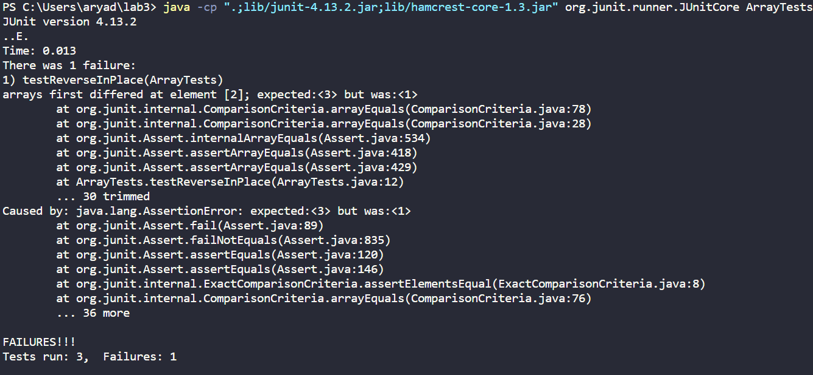

# Lab 2
## Part 1: String Server

### Code:

```java
import java.io.IOException;
import java.net.URI;
import java.util.ArrayList;
class Handler implements URLHandler {
    // The one bit of state on the server: a number that will be manipulated by
    // various requests.
    ArrayList<String> strings = new ArrayList<String>();
    public String handleRequest(URI url) {
        if (url.getPath().contains("/add-message")) {
            String[] parameters = url.getQuery().split("&");
            for(String i:parameters){
                String[] ps = i.split("=");
                if(ps[0].equals("s")){
                    strings.add(ps[1]);
                    break;
                }
            }
        }
        return String.join("\n",strings);
    }
}

class StringServer {
    public static void main(String[] args) throws IOException {
        if(args.length == 0){
            System.out.println("Missing port number! Try any number between 1024 to 49151");
            return;
        }

        int port = Integer.parseInt(args[0]);

        Server.start(port, new Handler());
    }
}
```

### Examples

#### Multiple Queries

the parameters get searched for the 's=bye' term, and then "bye" gets added to the strings ArrayList, which is displayed in the result
#### No Queries

the parameters get searched for the 's=' term, but none exist, so the previous values are displayed in the result
#### One Query

the parameters get searched for the 's=:)' term, and then ":)" gets added to the strings ArrayList, which is displayed in the result

## Part 2: Lab 3 Bug

### Original Code:
```Java
static void reverseInPlace(int[] arr) {
  for(int i = 0; i < arr.length; i += 1) {
    arr[i] = arr[arr.length - i - 1];
  }
}
```

### JUnit Tests
```Java
@Test 
public void testReverseInPlace() {
    //works as-is
    int[] input1 = { 3 };
    ArrayExamples.reverseInPlace(input1);
    assertArrayEquals(new int[]{ 3 }, input1);
    
    //doesn't work as-is
    int[] input2=new int[]{3,2,1};
    ArrayExamples.reverseInPlace(input2);
    assertArrayEquals(new int[]{1,2,3}, input2);
    int[] input3=new int[]{6,5,4,3,2,1};
    ArrayExamples.reverseInPlace(input3);
    assertArrayEquals(new int[]{1,2,3,4,5,6}, input3); 
}
```

### Symptom

The code only reverses the second half onto the first half

### The Fix
The problem is because the loop blindly reverses terms one at a time, and doesn't stop at the half. This can be fixed by only going halfway and reversing both terms, not just the left one
```Java
static void reverseInPlace(int[] arr) {
  for(int i = 0; i < arr.length - i - 1; i += 1) {
    int x=arr[i];
    arr[i] = arr[arr.length - i - 1];
    arr[arr.length - i - 1]=x;
  }
}
```

## Part 3: What did I learn
I learned that sometimes just because I fix a bug that causes a symptom, doesn't mean the code works. Sometimes, multiple bugs cause the same symptom, so I must make sure to find *all* bugs, not just a bug.
